# React + Vite

This template provides a minimal setup to get React working in Vite with HMR and some ESLint rules.

Currently, two official plugins are available:

- [@vitejs/plugin-react](https://github.com/vitejs/vite-plugin-react/blob/main/packages/plugin-react/README.md) uses [Babel](https://babeljs.io/) for Fast Refresh
- [@vitejs/plugin-react-swc](https://github.com/vitejs/vite-plugin-react-swc) uses [SWC](https://swc.rs/) for Fast Refresh


 <br />

## Screens
- Collections Page
- Product Details Page
- Authentication Page
- Chackout and Order Details Page 
- Admin Dashboard
- Error route -> Auto Redirect to Home Page
  <br />

## Quick Glimpses of the site :
<table>
  <tr>
    <td>Sign Up or Register Page <br/>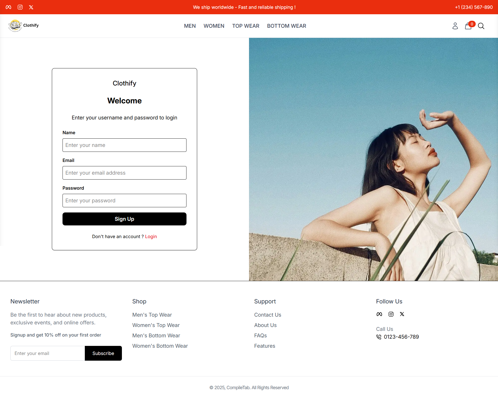</td>
    <td>Sign In or Log In Page<br/>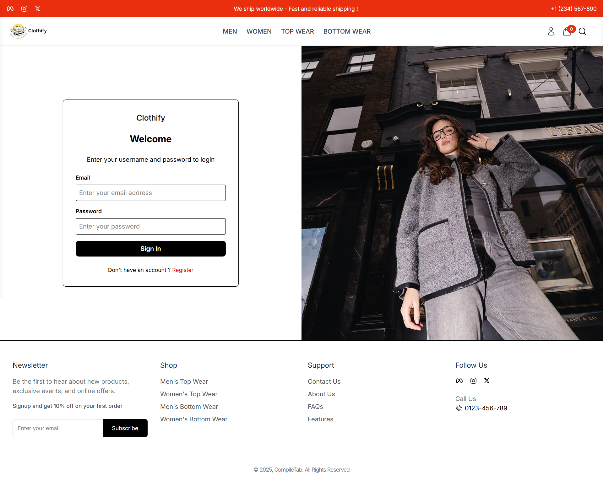</td>
  </tr>
  <tr>
    <td colspan="2">Home Page<br/> </td>
  </tr>
  <tr>
    <td>Collections Page <br/>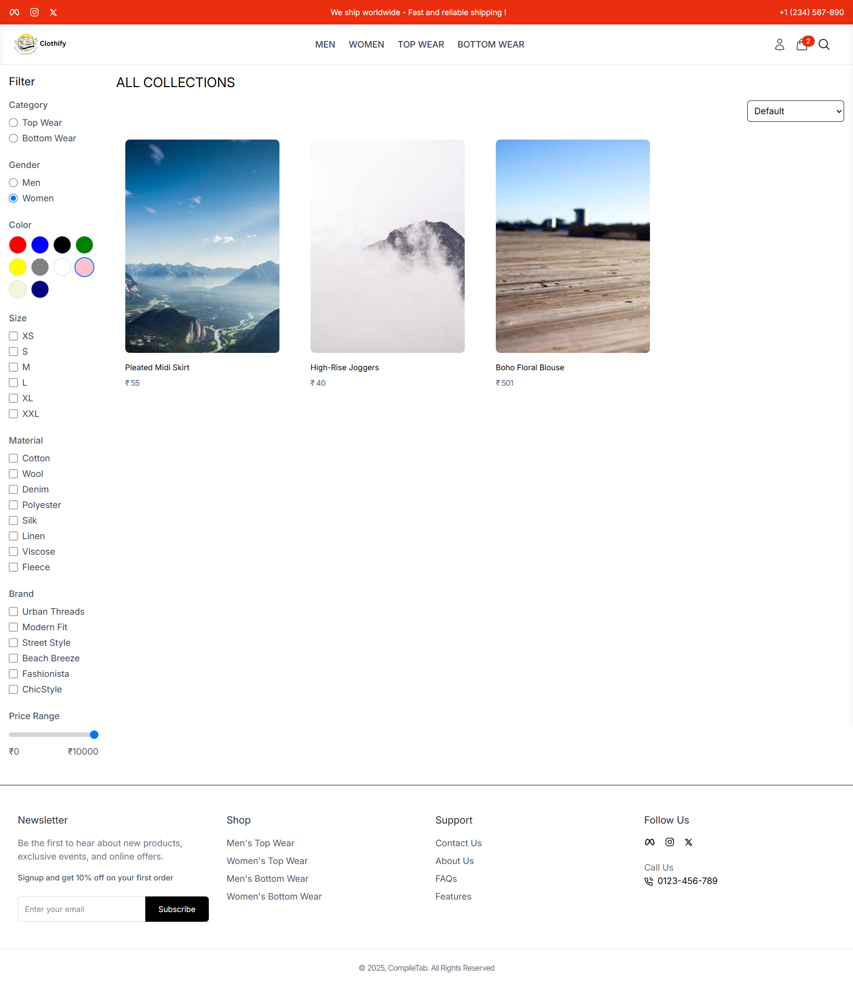</td>
    <td>Cart Functionality <br/>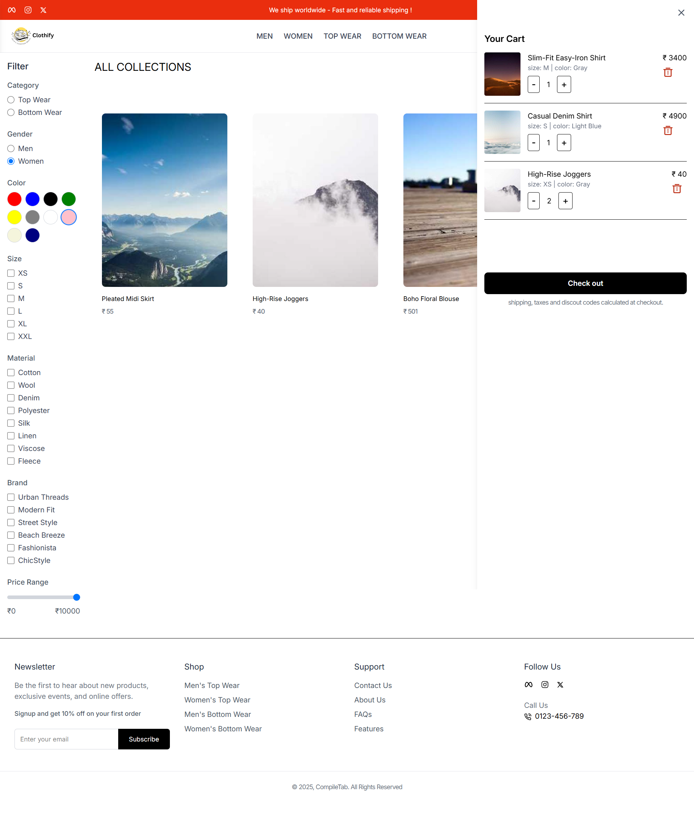</td>
  </tr>
  <tr>
    <td>Peoduct Details Page <br/>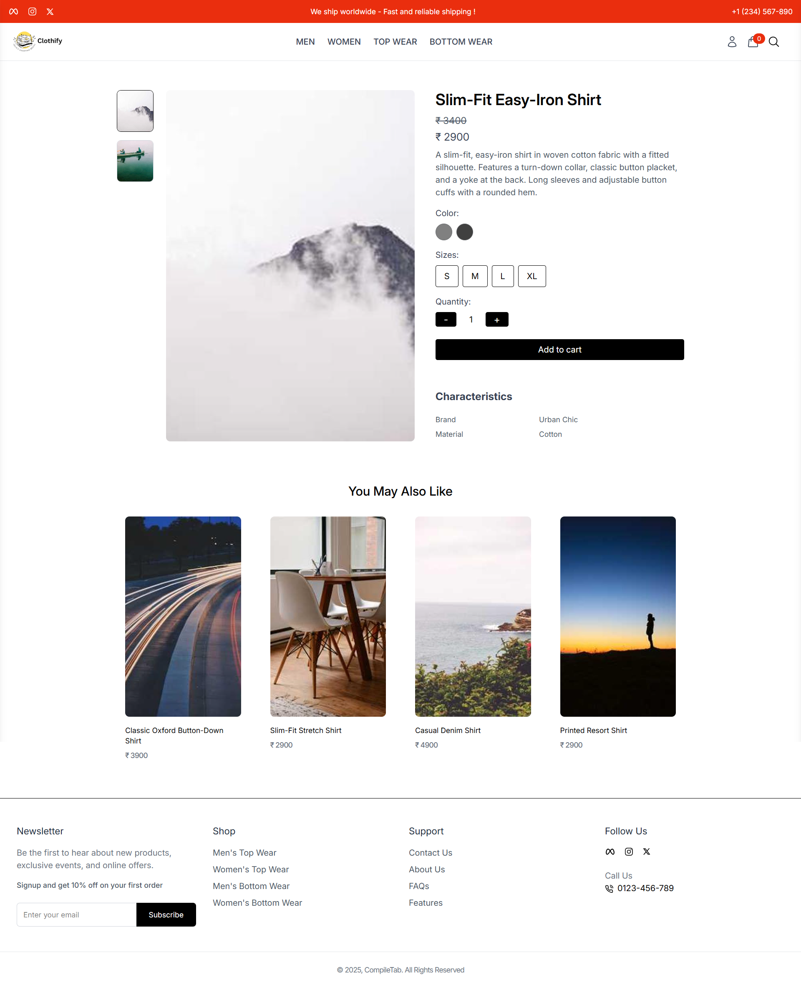</td>
    <td>Checkout Page <br/>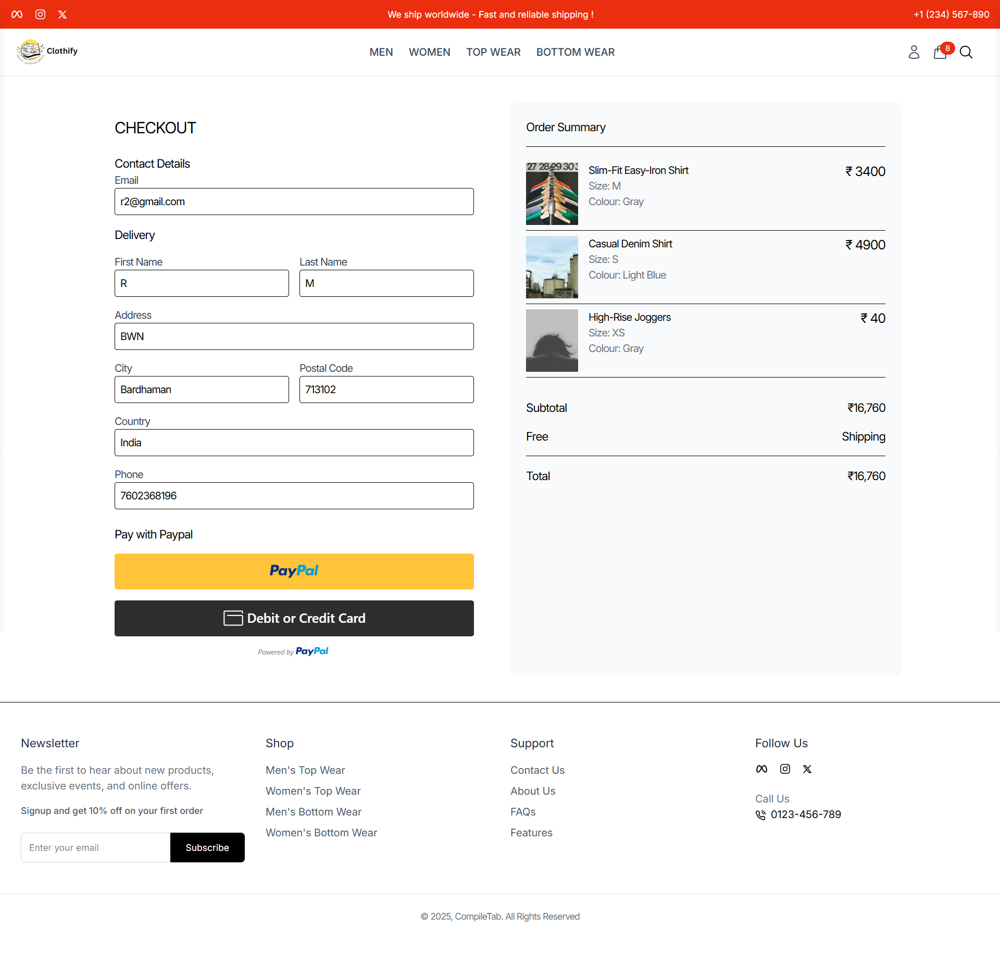</td>
  </tr>
 <tr>
    <td>Checkout Summary Page <br/>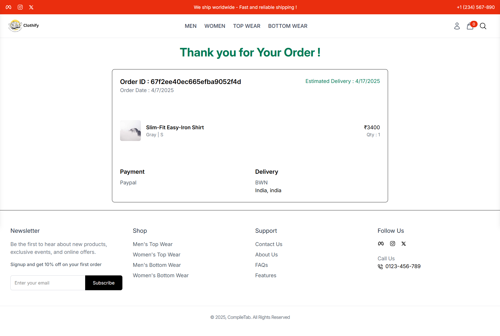</td>
    <td>Order Details Page <br/>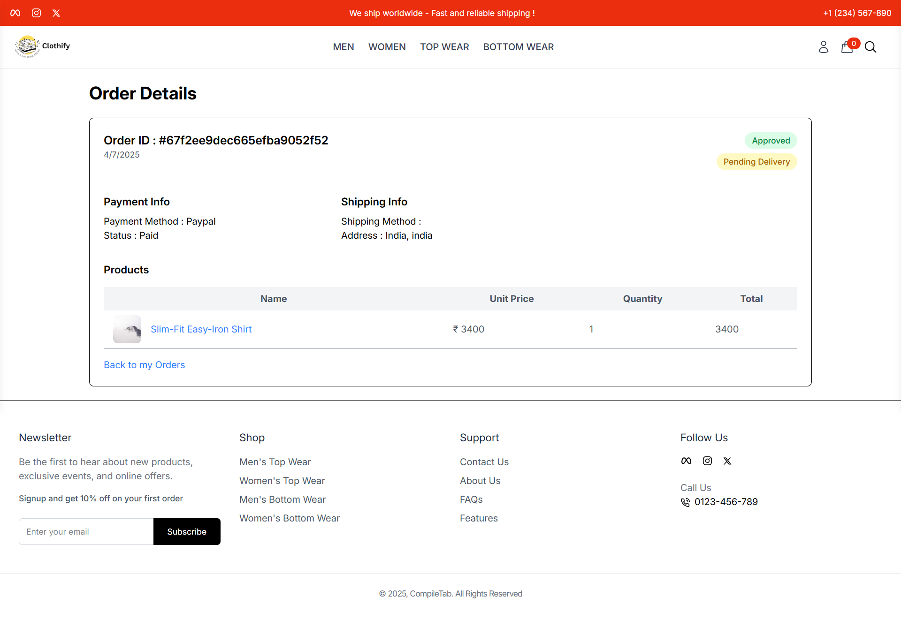</td>
  </tr>
 <tr>
    <td colspan="2">User Profile Page<br/> 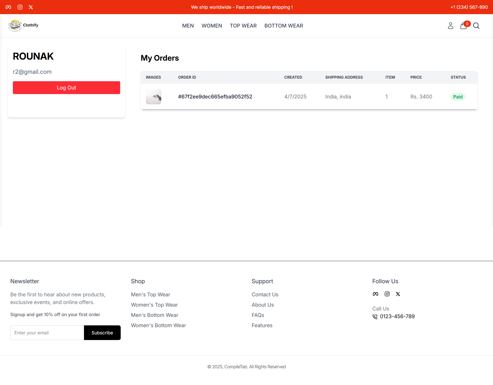</td>
  </tr>
 <tr>
    <td colspan="2">Admin Page<br/> 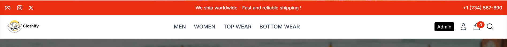</td>
  </tr>
 <tr>
    <td>Admin Dashboard <br/>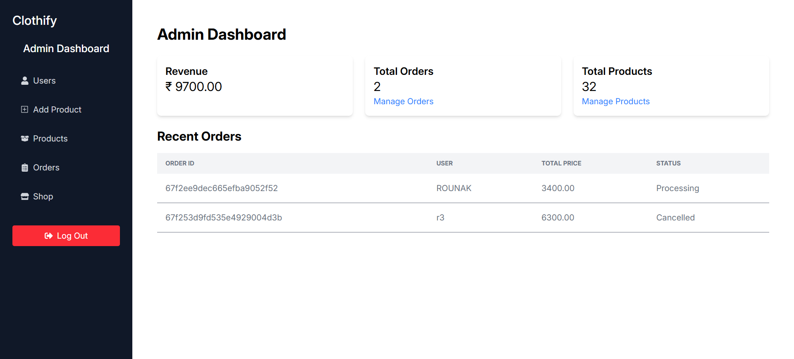</td>
    <td>Order Management Page <br/>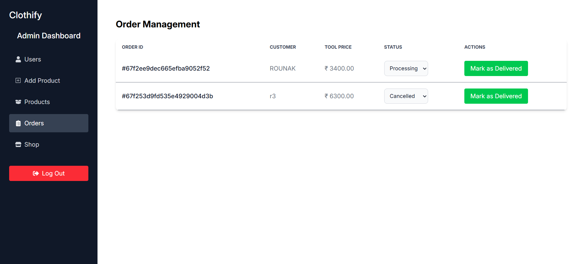</td>
  </tr>
 <tr>
    <td>Product Management Page <br/>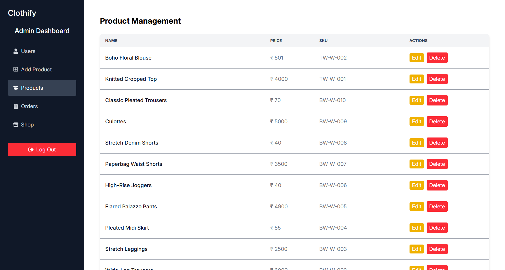</td>
    <td>User Management Page <br/>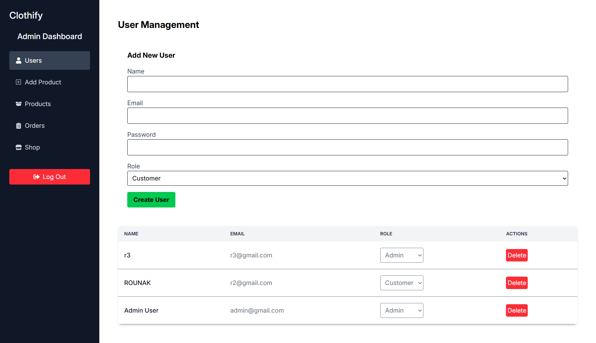</td>
  </tr>
<tr>
    <td colspan="2">Product Add and Edit Layout<br/> 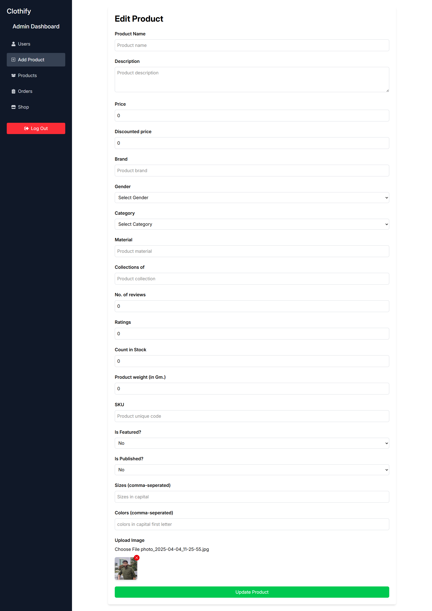</td>
  </tr>
 </table>
<br/>
<br/>

## Get Started
Here I have actually keep the frontend of Clothify web application.

## Clone the repo
First, clone the repo:

```bash
git clone https://github.com/Rounak00/clothify_client.git
```

## Add .env files that is the secret of this project
```bash
For frontend find .env by search import.meta.env as its a vite project
```

## For Dev Run
```bash
at root/frontend> npm install
at root.frontend> npm run dev
```

## For Production Run
```bash
at root> npm run build
at root> npm run start
```

<br/>

## Here is the Backend Repository 
> https://github.com/Rounak00/Chatify_server/
<br/>
